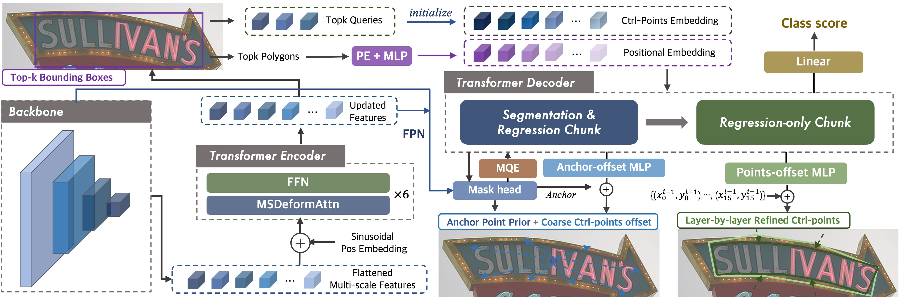

<h1 align="center"> SRFormer: Empowering Regression-Based Text Detection Transformer with Segmentation </h1> 


This is the official repo for the paper "SRFormer: Empowering Regression-Based Text Detection Transformer with Segmentation".

## Introduction



**Abstract.** Existing techniques for text detection can be broadly classified into two primary groups: segmentation-based methods and regression-based methods. 
Segmentation models offer enhanced robustness to font variations but require intricate post-processing, leading to high computational overhead. Regression-based methods undertake instance-aware prediction but face limitations in robustness and data efficiency due to their reliance on high-level representations. In our academic pursuit, we propose SRFormer, a unified DETR-based model with amalgamated Segmentation and Regression, aiming at the synergistic harnessing of the inherent robustness in segmentation representations, along with the straightforward post-processing of instance-level regression. Our empirical analysis indicates that favorable segmentation predictions can be obtained in the initial decoder layers. In light of this, we constrain the incorporation of segmentation branches to the first few decoder layers and employ progressive regression refinement in subsequent layers, achieving performance gains while minimizing additional computational load from the mask. Furthermore, we propose a Mask-informed Query Enhancement module, where we take the segmentation result as a natural soft-ROI to pool and extract robust pixel representations to diversify and enhance instance queries. Extensive experimentation across multiple benchmarks has yielded compelling findings, highlighting our method's exceptional robustness, superior training and data efficiency, as well as its state-of-the-art performance.

## Updates
**08/21/2023:** Core code \& checkpoints uploaded

## Main Results

|Benchmark|Backbone|Precision|Recall|F-measure|Pre-trained Model|Fine-tuned Model|
|:------:|:------:|:------:|:------:|:------:|:------:|:------:|
|Total-Text|Res50|92.2|87.9|90.0|[OneDrive](https://1drv.ms/u/s!AtF4kB5K12hqgUcE1EhRK17fFhNf?e=Yg1ula)|[Seg#1](https://1drv.ms/u/s!AtF4kB5K12hqgUnwxi_vVITCBG-w?e=2tQnYB); [Seg#2](https://1drv.ms/u/s!AtF4kB5K12hqgT8xV85-mDo6_Ino?e=Vf6hp2); [Seg#3](https://1drv.ms/u/s!AtF4kB5K12hqgUiPObZeQvYoAjnb?e=MD6UTo)|
|CTW1500|Res50|89.4|89.6|89.5|Same as above $\uparrow$ |[Seg#1](https://1drv.ms/u/s!AtF4kB5K12hqgU3EyDwv7-CDr8KY?e=H0606E); [Seg#3](https://1drv.ms/u/s!AtF4kB5K12hqgUz3PqgiXdoEH7kw?e=tHIeIg)|
|ICDAR19 ArT|Res50|86.2|73.4|79.3|[OneDrive](https://1drv.ms/u/s!AtF4kB5K12hqgUvaI9K329gHzQzz?e=mWeERS)|[Seg#1](https://1drv.ms/u/s!AtF4kB5K12hqgUpcOheps7ztstF1?e=Dw0KXA)|

## Usage

It's recommended to configure the environment using Anaconda. Python 3.10 + PyTorch 1.13.1 + CUDA 11.3 + Detectron2 are suggested.

- ### Installation
```
conda create -n SRFormer python=3.10 -y
conda activate SRFormer
pip install torch==1.13.1+cu111 torchvision==0.10.1+cu111 -f https://download.pytorch.org/whl/torch_stable.html
pip install opencv-python scipy timm shapely albumentations Polygon3
python -m pip install detectron2
pip install setuptools==59.5.0

cd SRFormer-Text-Detection
python setup.py build develop
```
- ### Data Preparation
  TBD

- ### Training

**1. Pre-train:**
To pre-train the model for Total-Text and CTW1500, the config file should be `configs/SRformer/Pretrain/R_50_poly.yaml`. For ICDAR19 ArT, please use `configs/SRFormer/Pretrain_ArT/R_50_poly.yaml`. Please adjust the GPU number according to your situation.

```
python tools/train_net.py --config-file ${CONFIG_FILE} --num-gpus 4
```

**2. Fine-tune:**
With the pre-trained model, use the following command to fine-tune it on the target benchmark. The pre-trained models are also provided.  For example:

```
python tools/train_net.py --config-file configs/SRFormer/TotalText/R_50_poly.yaml --num-gpus 4
```

- ### Evaluation
```
python tools/train_net.py --config-file ${CONFIG_FILE} --eval-only MODEL.WEIGHTS ${MODEL_PATH}
```
For ICDAR19 ArT, a file named `art_submit.json` will be saved in `output/r_50_poly/art/finetune/inference/`. The json file can be directly submitted to [the official website](https://rrc.cvc.uab.es/?ch=14) for evaluation.

- ### Inference & Visualization
```
python demo/demo.py --config-file ${CONFIG_FILE} --input ${IMAGES_FOLDER_OR_ONE_IMAGE_PATH} --output ${OUTPUT_PATH} --opts MODEL.WEIGHTS <MODEL_PATH>
```


## Acknowledgement

SRFormer is inspired a lot by and [TESTR](https://github.com/mlpc-ucsd/TESTR) and [DPText-DETR](https://github.com/ymy-k/DPText-DETR). Thanks for their great works!
